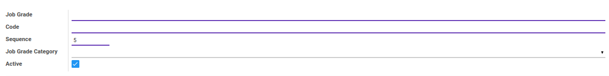
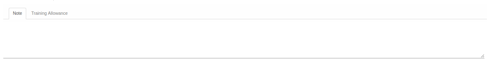
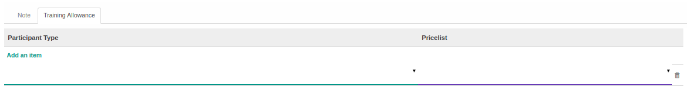

# Penjelasan

Informasi pada Job Grade dibagi menjadi beberapa area, diantaranya:

* [Header](#bagian-header)
* [Tab Note](#tab-note)
* [Tab Training Allowance](#tab-training-allowance)

### <a name="bagian-header">HEADER</a>

#### <a name="field-name">Job Grade</a>

Nama job grade

#### <a name="field-code">Code</a>

Kode job grade

#### <a name="field-sequence">Sequence</a>

No. Urut

#### <a name="field-category-id">Job Grade Category</a>

Mendefinisikan kategori job grade

#### <a name="field-active">Active</a>

Sebagai penanda apakah data adalah aktif/non-aktif

### <a name="tab-note">TAB NOTE</a>

#### <a name="field-note">Note</a>

Catatan atau Keterangan Job Grade

### <a name="tab-training-allowance">TAB TRAINING ALLOWANCE</a>

#### <a name="field-participant-type">Participant Type</a>

Tipe dari participant/peserta pelatihan

#### <a name="field-pricelist">Pricelist</a>

Pricelist yang dipakai untuk allowance
