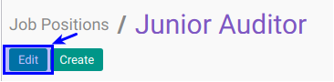

# Memodifikasi Job Positions

## A. INPUT

*(Tidak ada instruksi khusus)*

## B. LANGKAH KERJA

1. Buka menu **Human Resource -> Configuration -> Job Family Modelling -> Job Positions**. Abaikan jika sudah berada pada menu yang dimaksud.
2. Double klik pada data yang akan diedit
3. Klik tombol **Edit** pada bagian atas-kiri form.

4. Isi dan sesuaikan **[Job Name](./penjelasan.md#field-name)**. Harus diisi.
5. Pilih dan sesuaikan **[Job Family Level](./penjelasan.md#field-family-level-id)**. Tidak harus diisi.
6. Pilih dan sesuaikan **[Job Grade](./penjelasan.md#field-grade-id)**. Tidak harus diisi.
7. Pilih dan sesuaikan **[Department](./penjelasan.md#field-department-id)**. Tidak harus diisi.
8. Pilih dan sesuaikan **[Recruitment Responsible](./penjelasan.md#field-user-id)**. Tidak harus diisi.
9. Isi dan sesuaikan **[Spesific Email Address](./penjelasan.md#field-alias-name)**. Harus diisi.
10. Informasi **[current number of employees](./penjelasan.md#field-no-of-employee)** akan terisi otomatis sesuai jumlah karyawan yang ada di posisi tersebut.
11. Informasi **[new employee(s) expected](./penjelasan.md#field-no-of-employee)** akan terisi otomatis sesuai jumlah karyawan yang akan dibutuhkan di posisi tersebut selain yang sudah ada.
12. Pilih dan sesuaikan **[Interview Form](./penjelasan.md#field-interview-form)**. Tidak harus diisi.
13. Pilih dan sesuaikan **[Job Location](./penjelasan.md#field-job-location)**. Tidak harus diisi, default adalah lokasi perusahaan.
14. Pilih dan sesuaikan **[Training Allowance Pricelist](./penjelasan.md#field-pricelist)**. Tidak harus diisi. Jika module training diinstall
15. Buka **Tab Allowed Expense Product Categories**
16. <a name="l16">[Tambahkan](./membuat-allowed-product-categories.md)/[Hapus](./menghapus-allowed-product-categories.md)</a>  **Allowed Expense Product Categories**.
17. Buka **Tab Allowed Expense Product**
18. <a name="l18">[Tambahkan](./membuat-expense-product.md)/[Hapus](./menghapus-expense-product.md)</a>  **Allowed Expense Product**.
19. Buka **Tab All Allowed Expense Product**. Akan terisi otomatis sesuai item 16
20. Jika akan **disimpan** Klik tombol **Save** pada bagian atas-kiri form.

## C. OUTPUT

*(Tidak ada instruksi khusus)*
