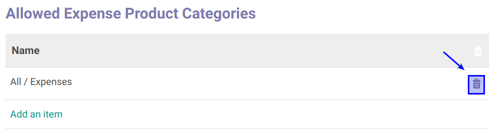

# Menghapus Allowed Expense Product Categories

*(Instruksi kerja ini merupakan sub instruksi dari (1) [Membuat Job Positions](./membuat.md), atau (2) [Memodifikasi Positions](./memodifikasi.md). Instruksi kerja ini tidak bisa berdiri sendiri)*

## A. INPUT

*(Tidak ada prasyarat khusus)*

## B. INSTRUKSI KERJA

1. Buka tab **Allowed Expense Product Categories**.
2. <a name="l2">Cari</a> data yang akan dihapus
3. Klik tombol **Hapus (Gambar Tong Sampah)** pada tabel **Allowed Product Categories**.

4. Klik OK pada untuk menghapus product categories yang dipilih.

5. Ulangi [langkah ke-2](#l2) untuk setiap allowed expense product categories yang akan dihapus.
6. Lanjutkan [langkah ke-15 instruksi Membuat Job Positions](./membuat.md#l15) atau [langkah ke-16 instruksi Memodifikasi Job Positions](./memodifikasi.md#l16).

## C. OUTPUT

*(Tidak ada instruksi khusus)*
