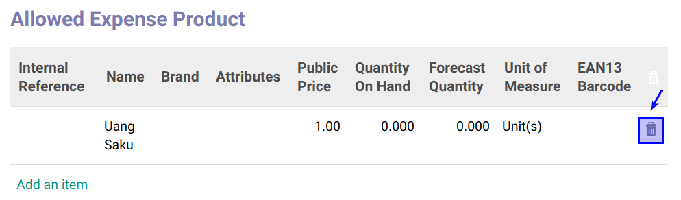

# Menghapus Allowed Expense Product

*(Instruksi kerja ini merupakan sub instruksi dari (1) [Membuat Job Positions](./membuat.md), atau (2) [Memodifikasi Job Positions](./memodifikasi.md). Instruksi kerja ini tidak bisa berdiri sendiri)*

## A. INPUT

*(Tidak ada prasyarat khusus)*

## B. INSTRUKSI KERJA

1. Buka tab **Allowed Expense Product**.
2. <a name="l2">Cari</a> data yang akan dihapus
3. Klik tombol **Hapus (Gambar Tong Sampah)** pada tabel **Allowed Product**.

4. Klik OK pada untuk menghapus product yang dipilih.

5. Ulangi [langkah ke-2](#l2) untuk setiap allowed expense product yang akan dihapus.
6. Lanjutkan [langkah ke-17 instruksi Membuat Job Positions](./membuat.md#l17) atau [langkah ke-18 instruksi Memodifikasi Job Positions](./memodifikasi.md#l18).

## C. OUTPUT

*(Tidak ada instruksi khusus)*
