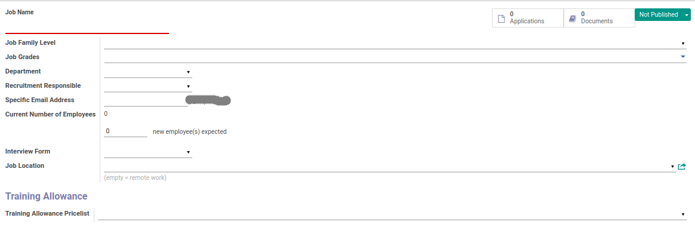
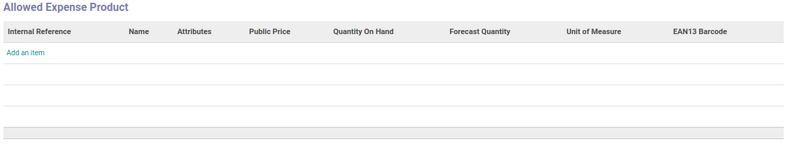
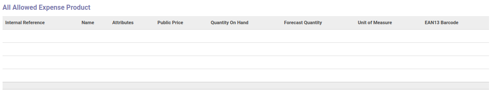

# Penjelasan

Informasi pada *department* dibagi menjadi 4 (empat) bagian, yaitu:

* [Header](#bagian-header)
* [Training Allowance Pricelist](#field-pricelist) jika module training *diinstal*
* [Allowed Expense Product Categories](#bagian-allowed-expense-product-categories)
* [Allowed Expense Product](#bagian-allowed-expense-product)
* [Allowed Expense Product](#bagian-all-allowed-expense-product)

### <a name="bagian-header">HEADER</a>

#### <a name="field-name">Job Name</a>

Nama job/posisi jabatan

#### <a name="field-family-level-id">Job Family Level</a>

Mendefinisikan job family level

#### <a name="field-grade-id">Job Grades</a>

Mendefinisikan job grade

#### <a name="field-department-id">Department</a>

Mendefinisikan departemen

#### <a name="field-user-id">Recruitment Responsible</a>

Mendefinisikan siapa yang bertanggung jawab untuk melakukan recruitment

#### <a name="field-alias-name">Specific Email Address</a>

Mendefinisikan alamat email

#### <a name="field-no-of-employee">Current Number of Employees</a>

Memberikan informasi tentang seberapa banyak total karyawan yang sudah menduduki posisi terkait dan juga mendefinisikan seberapa banyak karyawan baru yang diharapkan untuk menduduki jabatan terkait

#### <a name="field-interview-form">Interview Form</a>

Mendefinisikan form yang digunakan dalam melakukan interview

#### <a name="field-job-location">Job Location</a>

Mendefinisikan lokasi pekerjaan yang akan dilakukan

#### <a name="field-pricelist">Training Allowance Pricelist</a>
>**Catatan:** Isian ini hanya muncul jika module training *diinstall*

Pricelist yang dipakai untuk allowance

### <a name="bagian-allowed-expense-product-categories">Allowed Expense Product Categories</a>

Mendefiniskan kategori produk yang diperbolehkan

### <a name="bagian-allowed-expense-product">Allowed Expense Product</a>

Mendefiniskan produk yang diperbolehkan

### <a name="bagian-all-allowed-expense-product">All Allowed Expense Product</a>

Informasi mengenai semua produk yang diperbolehkan termasuk produk-produk yang memiliki kategori yang sudah didefinisikan pada isian **Allowed Expense Product Categories** diatas
