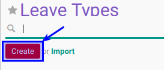
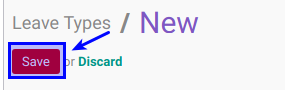

# Membuat Leave Types

## A. INPUT

*(Tidak ada instruksi khusus)*

## B. LANGKAH KERJA

1. Buka menu **Human Resource -> Configuration -> Leaves Type**. Abaikan jika sudah berada pada menu yang dimaksud.
2. Klik tombol **Create** pada bagian atas-kiri form.

3. Isi **[Leave Type](./penjelasan.md#field-name)**. Harus diisi.
4. Pilih **[Meeting Type](./penjelasan.md#field-categ-id)**. Tidak harus diisi
5. Buka **Tab Detail**
6. Centang **[Apply Double Validation](./penjelasan.md#bagian-details-validations-field-double-validation)** jika diperlukan.
7. Centang **[Allow to Override Limit](./penjelasan.md#bagian-details-validations-field-limit)** jika diperlukan.
8. Centang **[Limit Days Per Request](./penjelasan.md#bagian-details-validations-field-limit-days-per-request)** jika diperlukan.
9. Isi **[Days Limit Per Request](./penjelasan.md#bagian-details-validations-field-limit-day-limit-per-request)**. Diisi jika item 8 dicentang.
10. Pilih **[Color in Report](./penjelasan.md#bagian-details-misc-field-color-name)**. Tidak harus diisi
11. Aktifkan **[Active](./penjelasan.md#field-active)** jika dibutuhkan.
12. Centang **[Exclude Rest Days](./penjelasan.md#bagian-details-misc-field-excl-rest-day)** jika diperlukan.
13. Centang **[Exclude Public Holiday](./penjelasan.md#bagian-details-misc-field-exclude-public-holiday)** jika diperlukan.
14. Jika akan **disimpan** Klik tombol **Save** pada bagian atas-kiri form.

## C. OUTPUT

*(Tidak ada instruksi khusus)*
