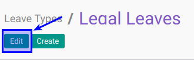

# Memodifikasi Leave Types

## A. INPUT

*(Tidak ada instruksi khusus)*

## B. LANGKAH KERJA

1. Buka menu **Human Resource -> Configuration -> Leaves Type**. Abaikan jika sudah berada pada menu yang dimaksud.
2. Double klik pada data yang akan diedit
3. Klik tombol **Edit** pada bagian atas-kiri form.

4. Isi dan sesuaikan **[Leave Type](./penjelasan.md#field-name)**. Harus diisi.
5. Pilih dan sesuaikan **[Meeting Type](./penjelasan.md#field-categ-id)**. Tidak harus diisi
6. Buka **Tab Detail**
7. Centang dan sesuaikan **[Apply Double Validation](./penjelasan.md#bagian-details-validations-field-double-validation)** jika diperlukan.
8. Centang dan sesuaikan **[Allow to Override Limit](./penjelasan.md#bagian-details-validations-field-limit)** jika diperlukan.
9. Centang dan sesuaikan **[Limit Days Per Request](./penjelasan.md#bagian-details-validations-field-limit-days-per-request)** jika diperlukan.
10. Isi dan sesuaikan **[Days Limit Per Request](./penjelasan.md#bagian-details-validations-field-limit-day-limit-per-request)**. Diisi jika item 8 dicentang.
11. Pilih dan sesuaikan **[Color in Report](./penjelasan.md#bagian-details-misc-field-color-name)**. Tidak harus diisi
12. Aktifkan dan sesuaikan  **[Active](./penjelasan.md#field-active)** jika dibutuhkan.
13. Centang dan sesuaikan **[Exclude Rest Days](./penjelasan.md#bagian-details-misc-field-excl-rest-day)** jika diperlukan.
14. Centang dan sesuaikan **[Exclude Public Holiday](./penjelasan.md#bagian-details-misc-field-exclude-public-holiday)** jika diperlukan.
15. Jika akan **disimpan** Klik tombol **Save** pada bagian atas-kiri form.

## C. OUTPUT

*(Tidak ada instruksi khusus)*
