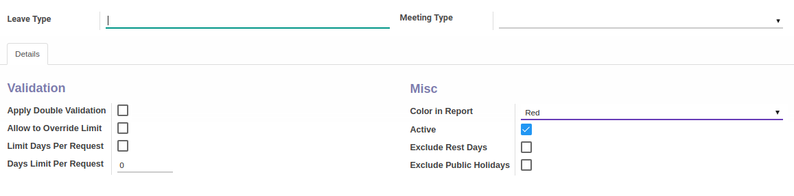

# Penjelasan

### <a name="bagian-header">HEADER</a>

#### <a name="field-name">Leave Type</a>

Nama leave type

#### <a name="field-categ-id">Meeting Type</a>

Mendefinisikan meeting type

### <a name="bagian-details">DETAILS</a>

### <a name="bagian-details-validations">Validations</a>

#### <a name="bagian-details-validations-field-double-validation">Apply Double Validation</a>

Jika dicentang, maka proses alokasi/permintaan cuti untuk tipe ini akan memiliki _double validation_(2x Validasi)

#### <a name="bagian-details-validations-field-limit">Allow to Override Limit</a>

Jika dicentang, maka karyawan dibolehkan mengambil cuti lebih dari batasannya

#### <a name="bagian-details-validations-field-limit-days-per-request">Limit Days Per Request</a>

Jika dicentang, maka jumlah hari per permintaan cuti akan dibatasi

#### <a name="bagian-details-validations-field-limit-day-limit-per-request">Days Limit Per Request</a>

Mendefinisikan batasan total hari per permintaan cuti

### <a name="bagian-details-misc">Misc</a>

#### <a name="bagian-details-misc-field-color-name">Color in Report</a>

Mendefiniskan warna yang akan digunakan pada reporting

#### <a name="field-active">Active</a>

Sebagai penanda apakah data adalah aktif/non-aktif

#### <a name="bagian-details-misc-field-color-name">Exclude Rest Days</a>

Jika dicentang, maka hari istirahat karyawan tidak akan dimasukan dalam perhitungan cuti

#### <a name="bagian-details-misc-field-color-name">Exclude Public Holidays</a>

Jika dicentang, maka hari libur nasional tidak akan dimasukan dalam perhitungan cuti