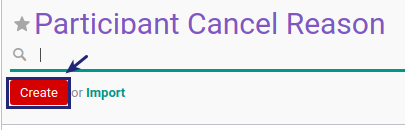

# Membuat Participant Cancel Reason

## A. INPUT

*(Tidak ada instruksi khusus)*

## B. LANGKAH KERJA

1. Buka menu **Human Resource -> Configuration -> Training -> Participant Cancel Reason**. Abaikan jika sudah berada pada menu yang dimaksud.
2. Klik tombol **Create** pada bagian atas-kiri form.

3. Isi **[Participant Cancel Reason](./penjelasan.md#field-name)**. Harus diisi.
4. Centang **[Active](./penjelasan.md#field-active)** jika berstatus aktif. Tidak Harus diisi.
5. Isi **[Notes](./penjelasan.md#field-notes)**. Tidak Harus diisi.
6. Jika akan **disimpan** Klik tombol **Save** pada bagian atas-kiri form.

## C. OUTPUT

*(Tidak ada instruksi khusus)*
