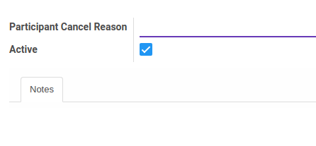

# Penjelasan Participant Cancel Reason

### <a name="bagian-header">HEADER</a>

#### <a name="field-name">Participant Cancel Reason</a>

Definisikan nama alasan pembatalan peserta mengikuti pelatihan

#### <a name="field-active">Active</a>

Sebagai penanda apakah data adalah aktif/non-aktif

#### <a name="field-notes">Notes</a>

Isikan catatan alasan pembatalan peserta mengikuti pelatihan untuk menjelaskan lebih detail
