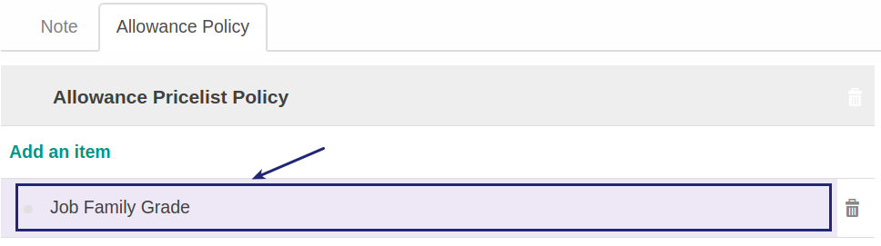

# Memodifikasi Allowance Policy

*(Instruksi kerja ini merupakan sub instruksi dari (1) [Membuat Participant Type](./membuat.md), atau (2) [Memodifikasi Participant Type](./memodifikasi.md). Instruksi kerja ini tidak bisa berdiri sendiri)*

## A. INPUT

*(Tidak ada prasyarat khusus)*

## B. INSTRUKSI KERJA

1. Buka tab **Allowance Policy**.
2. <a name="l2">Pilih/Klik</a> data **yang akan diedit** pada tabel **Allowance Policy**.

3. Pilih dan sesuaikan **[Allowance Policy](./penjelasan.md#field-allowance-policy)** jika diperlukan. Harus Diisi.
4. Ulangi [langkah ke-2](#l2) untuk memodifikasi Allowance Policy.
5. Lanjutkan [langkah ke-6 instruksi Membuat Participant Type](./membuat.md#taballowance) atau [langkah ke-7 instruksi Memodifikasi Participant Type](./memodifikasi.md#taballowance).

## C. OUTPUT

*(Tidak ada instruksi khusus)*
