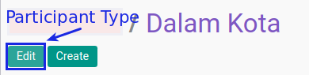

# Memodifikasi Participant Type

## A. INPUT

*(Tidak ada instruksi khusus)*

## B. LANGKAH KERJA

1. Buka menu **Human Resource -> Configuration -> Training -> Participant Type**. Abaikan jika sudah berada pada menu yang dimaksud.
2. Double klik pada data yang akan diedit
3. Klik tombol **Edit** pada bagian atas-kiri form.

4. Isi **[Participant Type](./penjelasan.md#field-name)**. Harus diisi.
5. Centang **[Active](./penjelasan.md#field-active)** jika berstatus aktif. Tidak Harus diisi.
6. Klik **[Tab Notes](./penjelasan.md#tab-note)**.
    - Isi **[Notes](./penjelasan.md#field-notes)**. Tidak Harus diisi.
7. Klik **[Tab Allowance Policy](./penjelasan.md#tab-allowance)**.
    - <a name="taballowance">[Tambahkan](./membuat-allowance-policy.md)/[Modifikasi](./memodifikasi-allowance-policy.md)/[Hapus](./menghapus-allowance-policy.md)</a>  **Allowance Policy**.
8. Jika akan **disimpan** Klik tombol **Save** pada bagian atas-kiri form.

## C. OUTPUT

*(Tidak ada instruksi khusus)*
