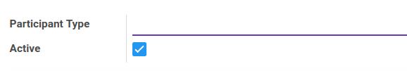
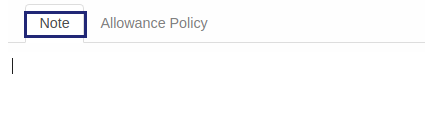

# Penjelasan Participant Type

Informasi pada menu training category dibagi menjadi beberapa area, diantaranya:

* [Header](#bagian-header)
* [Tab Note](#tab-note)
* [Tab Allowance Policy](#tab-allowance)

### <a name="bagian-header">HEADER</a>

#### <a name="field-name">Participant Type</a>

Definisikan Nama Tipe/Jenis Peserta

#### <a name="field-active">Active</a>

Sebagai penanda apakah data adalah aktif/non-aktif

### <a name="tab-note">TAB NOTE</a>

#### <a name="field-notes">Notes</a>

Isikan catatan untuk tipe peserta untuk menjelaskan lebih detail

### <a name="tab-allowance">TAB ALLOWANCE POLICY</a>

#### <a name="field-allowance-policy">Allowance Policy</a>

Pilih Allowance Policy yang berlaku
