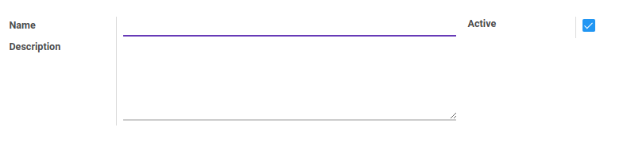

# Penjelasan

### <a name="bagian-header">HEADER</a>

#### <a name="field-name">Name</a>

Nama tipe payslip

#### <a name="field-active">Active</a>

Sebagai penanda apakah data adalah aktif/non-aktif

#### <a name="field-description">Description</a>

Catatan/deskripsi mengenai payslip type
