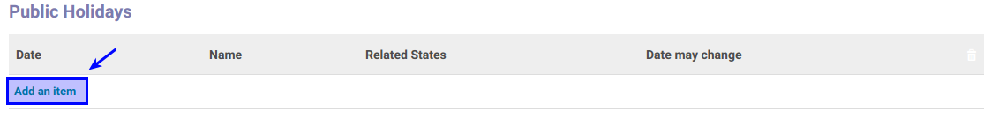

# Membuat Item Public Holidays

*(Instruksi kerja ini merupakan sub instruksi dari (1) [Membuat Public Holidays](./membuat.md), atau (2) [Memodifikasi Public Holidays](./memodifikasi.md). Instruksi kerja ini tidak bisa berdiri sendiri)*

## A. INPUT

*(Tidak ada prasyarat khusus)*

## B. INSTRUKSI KERJA

1. Buka tab **Public Holidays**.
2. <a name="l2">Klik</a> tombol **Add an Item** pada tabel **Public Holidays**.

3. Isi **[Date](./penjelasan.md#field-button-manual)**. Harus diisi.
4. Isi **[Name](./penjelasan.md#field-button-manual)**. Harus diisi.
5. Pilih **[Related States](./penjelasan.md#field-button-manual)**. Tidak Harus diisi.
6. Centang **[Date May Changes](./penjelasan.md#field-button-manual)** jika diperlukan.

7. Ulangi [langkah ke-2](#l2) untuk menambahkan hari libur.
8. Lanjutkan [langkah ke-6 instruksi Membuat Public Holidays](./membuat.md#l6) atau [langkah ke-7 instruksi Memodifikasi - Public Holidays](./memodifikasi.md#l7)

## C. OUTPUT

*(Tidak ada instruksi khusus)*
