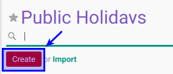

# Membuat Public Holidays

## A. INPUT

*(Tidak ada instruksi khusus)*

## B. LANGKAH KERJA

1. Buka menu **Human Resource -> Configuration -> Public Holidays**. Abaikan jika sudah berada pada menu yang dimaksud.
2. Klik tombol **Create** pada bagian atas-kiri form.

3. Isi **[Calendar Year](./penjelasan.md#field-year)**. Harus diisi.
4. Isi **[Country](./penjelasan.md#field-country-id)**. Tidak Harus diisi.
5. Buka **Tab Public Holidays**
6. <a name="l6">[Tambahkan](./membuat-public-holidays.md)/[Modifikasi](./modifikasi-public-holidays.md)/[Hapus](./hapus-public-holidays.md)</a>  **Item Public Holidays**.
7. Jika akan **disimpan** Klik tombol **Save** pada bagian atas-kiri form.

## C. OUTPUT

*(Tidak ada instruksi khusus)*
