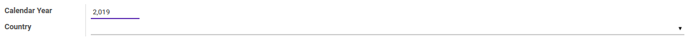
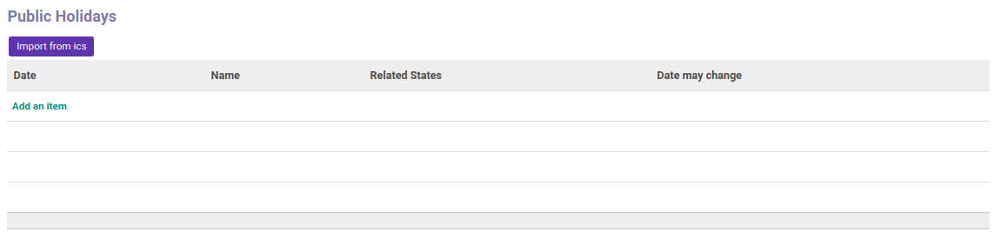
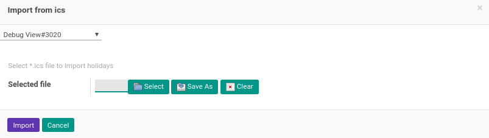

# Penjelasan

### <a name="bagian-header">HEADER</a>

#### <a name="field-year">Calendar Year</a>

Tahun kalender

#### <a name="field-country-id">Country</a>

Mendefinisikan negara

### <a name="bagian-details">PUBLIC HOLIDAYS</a>

Data *Public Holidays*(Libur Nasional) dapat diisi dengan 2 cara, yaitu:

- #### <a name="field-button-import">Import from ics</a>

Mengimport data libur nasional dari iCalender File.

- #### <a name="field-button-import">Manual Input dengan **Add an Item**</a>
    - **Date:** Mendefinisilkan tanggal libur
    - **Name:** Nama/deskripsi libur
    - **Related States:** Mendefinisikan propinsi yang memiliki hari libur terkait
    - **Date May Changes:** Jika dicentang, maka tanggal bisa berubah sewaktu-waktu