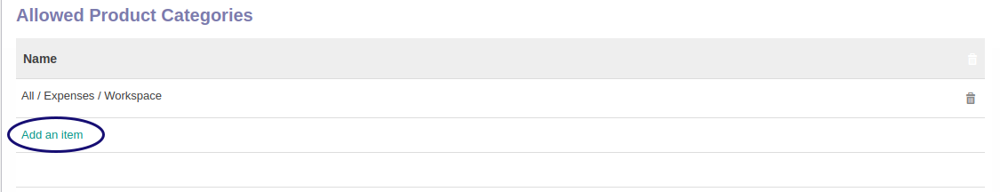
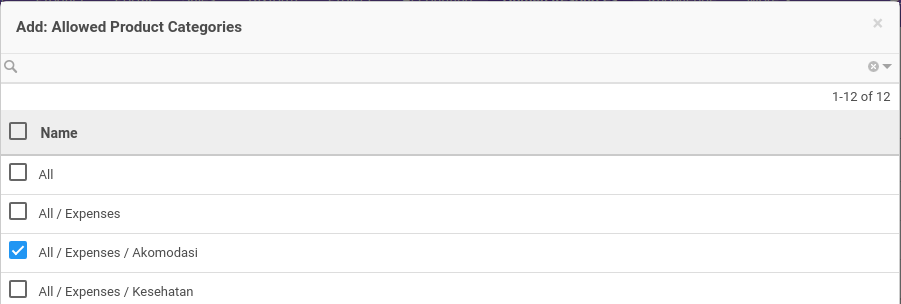

# Membuat Product Category

Allowed Product Categories **diinput** jika ada ada product categories yang diperbolehkan dalam jenis reimbursement.

*(Instruksi kerja ini merupakan sub instruksi dari (1) [Membuat Reimbursement Type](./membuat.md), atau (2) [Memodifikasi Reimbursement](./memodifikasi.md). Instruksi kerja ini tidak bisa berdiri sendiri)*

## A. INPUT

*(Tidak ada prasyarat khusus)*

## B. INSTRUKSI KERJA

1. Buka **[Tabel Allowed Product Category](./penjelasan.md#tab-tab-allowed-product-category)**.
2. <a name="l2">Klik</a> tombol **Add an Item** pada tabel **Allowed Product Categories**.

3. Pilih **[Name](./penjelasan.md#field-product-category)**. Centang product categories.

4. Klik Select pada bagian bawah kiri jika ada product categories yang dipilih.

5. Ulangi [langkah ke-2](#l2) untuk setiap allowed product categories yang akan ditambahkan.
6. Lanjutkan [langkah ke-9 instruksi Membuat Reimbursement Type](./membuat.md#l9) atau [langkah ke-10 instruksi Memodifikasi Reimbursement Type](./memodifikasi.md#l10).

## C. OUTPUT

*(Tidak ada instruksi khusus)*

## Chapter
- [Konfigurasi](../../konfigurasi.md)
- [Penjelasan Reimbursement Type](./penjelasan.md)
- [Membuat Reimbursement Type](./membuat.md)
- [Memodifikasi Reimbursement Type](./memodifikasi.md)
- [Menghapus Reimbursement Type](./menghapus.md)
- [Membuat Product Category](./membuat-product-category.md)
- [Menghapus Product Category](./menghapus-product-category.md)
- [Membuat Product](./membuat-product.md)
- [Menghapus Product](./menghapus-product.md)
