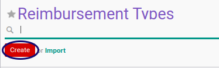

# Membuat Reimbursement Type

## A. INPUT

*(Tidak ada instruksi khusus)*

## B. LANGKAH KERJA

1. Buka menu **Human Resource -> Configuration -> Reimbursement -> Reimbursement Type**.
2. Klik tombol **Create** pada bagian atas-kiri form.

3. Isi **[Employee Reimbursement Type](./penjelasan.md#field-name)**. Harus diisi.
4. Isi **[Code](./penjelasan.md#field-code)**. Harus diisi.
5. Aktifkan **[Active](./penjelasan.md#field-active)** jika dibutuhkan.
6. Isi **[Sequence](./penjelasan.md#field-sequence)**. Tidak Harus diisi.
7. Beralih ke **[Tab Allowed Products](./penjelasan.md#tab-allowed-product)**.
8. Buka **[Tabel Allowed Product Category](./penjelasan.md#tab-tab-allowed-product-category)**.
9. <a name="l9">[Tambah](./membuat-product-category.md)/[Hapus](./menghapus-product-category.md)</a>  **Allowed Product Category**. Lakukan sampai semua kategori produk yang diperbolehkan diisi sesuai kebutuhan.
10. Buka **[Tabel Allowed Product](./penjelasan.md#tab-tab-allowed-product)**.
11. <a name="l11">[Tambah](./membuat-product.md)/[Hapus](./menghapus-product.md)</a>  **Allowed Product**. Lakukan sampai semua produk yang diperbolehkan diisi sesuai kebutuhan.
12. Beralih ke tab **[Tab Accounting](./penjelasan.md#tab-accounting)**.
13. Pilih **[Journal](./penjelasan.md#field-journal)**. Tidak Harus diisi.
14. Pilih **[Payable Account](./penjelasan.md#field-payable-account)**. Harus diisi.
15. Beralih ke **[Tab Expense Account](./penjelasan.md#tab-expense-account)**
16. <a name="l16">[Tambah](./menambahkan-expense-account.md)/[Hapus](./menghapus-expense-account.md)</a>  **Expense Account**. Lakukan sampai semua expense account yang diperbolehkan diisi sesuai kebutuhan.
17. Beralih ke **[Tab Workflow Policy](./penjelasan.md#tab-workflow-policy)**.
18. Pilih **[Allow To Confirm Reimbursement](./penjelasan.md#field-confirm)**. Tidak Harus diisi.
19. Pilih **[Allow To Restart Reimbursement Approval](./penjelasan.md#field-restart-approval)**. Tidak Harus diisi.
20. Pilih **[Allow To Change Reimbursement Detail](./penjelasan.md#field-change)**. Tidak Harus diisi.
21. Pilih **[Allow To Cancel Reimbursement](./penjelasan.md#field-cancel)**. Tidak Harus diisi.
22. Pilih **[Allow To Terminate Reimbursement](./penjelasan.md#field-terminate)**. Tidak Harus diisi.
23. Pilih **[Allow To Restart Reimbursement](./penjelasan.md#field-restart)**. Tidak Harus diisi.
24. Beralih ke **[Tab Note](./penjelasan.md#tab-note)**.
25. Isi **[Note](./penjelasan.md#field-note)**. Tidak harus diisi.
26. Klik tombol **Save** pada bagian atas-kiri form.

## C. OUTPUT

* Data Reimbursement Type akan tersimpan.

## Chapter
- [Konfigurasi](../../konfigurasi.md)
- [Penjelasan Reimbursement Type](./penjelasan.md)
- [Memodifikasi Reimbursement Type](./memodifikasi.md)
- [Menghapus Reimbursement Type](./menghapus.md)
- [Membuat Product Category](./membuat-product-category.md)
- [Menghapus Product Category](./menghapus-product-category.md)
- [Membuat Product](./membuat-product.md)
- [Menghapus Product](./menghapus-product.md)
