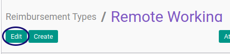

# Memodifikasi Reimbursement Type

## A. INPUT

*(Tidak ada instruksi khusus)*

## B. LANGKAH KERJA

1. Buka menu **Human Resource -> Configuration -> Reimbursement -> Reimbursement Type**. Abaikan jika sudah berada pada menu yang dimaksud.
2. Double klik pada data yang akan diedit.
3. Klik tombol **Edit** pada bagian atas-kiri form.

4. Sesuaikan **[Employee Reimbursement Type](./penjelasan.md#field-name)** jika dibutuhkan. Harus diisi.
5. Sesuaikan **[Code](./penjelasan.md#field-code)** jika dibutuhkan. Harus diisi.
6. Aktifkan **[Active](./penjelasan.md#field-active)** jika dibutuhkan.
7. Sesuaikan **[Sequence](./penjelasan.md#field-sequence)**. Tidak Harus diisi.
8. Buka **[Tab Allowed Products](./penjelasan.md#tab-allowed-product)**.
9. Buka **[Tabel Allowed Product Category](./penjelasan.md#tab-tab-allowed-product-category)**.
10. <a name="l10">[Tambah](./membuat-product-category.md)/[Hapus](./menghapus-product-category.md)</a>  **Allowed Product Category**. Lakukan sampai semua kategori produk yang diperbolehkan diisi sesuai kebutuhan.
11. Buka **[Tabel Allowed Product](./penjelasan.md#tab-tab-allowed-product)**.
12. <a name="l12">[Tambah](./membuat-product.md)/[Hapus](./menghapus-product.md)</a>  **Allowed Product**. Lakukan sampai semua produk yang diperbolehkan diisi sesuai kebutuhan.
13. Buka **[Tab Accounting](./penjelasan.md#tab-accounting)**.
14. Sesuaikan **[Journal](./penjelasan.md#field-journal)** jika dibutuhkan. Tidak Harus diisi.
15. Sesuaikan **[Payable Account](./penjelasan.md#field-payable-account)** jika dibutuhkan. Harus diisi.
16. Buka **[Tab Workflow Policy](./penjelasan.md#tab-workflow-policy)**.
17. Sesuaikan **[Allow To Confirm Reimbursement](./penjelasan.md#field-confirm)** jika dibutuhkan. Tidak Harus diisi.
18. Sesuaikan **[Allow To Restart Reimbursement Approval](./penjelasan.md#field-restart-approval)** jika dibutuhkan. Tidak Harus diisi.
19. Sesuaikan **[Allow To Change Reimbursement Detail](./penjelasan.md#field-change)** jika dibutuhkan. Tidak Harus diisi.
20. Sesuaikan **[Allow To Cancel Reimbursement](./penjelasan.md#field-cancel)** jika dibutuhkan. Tidak Harus diisi.
21. Sesuaikan **[Allow To Terminate Reimbursement](./penjelasan.md#field-terminate)** jika dibutuhkan. Tidak Harus diisi.
22. Sesuaikan **[Allow To Restart Reimbursement](./penjelasan.md#field-restart)** jika dibutuhkan. Tidak Harus diisi.
23. Buka **[Tab Note](./penjelasan.md#tab-tab-note)**.
24. Sesuaikan **[Note](./penjelasan.md#field-note)** jika dibutuhkan. Tidak harus diisi.
25. Klik tombol **Save** pada bagian atas-kiri form. 

## C. OUTPUT

* Data Reimbursement Type akan tersimpan sesuai perubahan.

## Chapter
- [Konfigurasi](../../konfigurasi.md)
- [Penjelasan Reimbursement Type](./penjelasan.md)
- [Membuat Reimbursement Type](./membuat.md)
- [Menghapus Reimbursement Type](./menghapus.md)
- [Membuat Product Category](./membuat-product-category.md)
- [Menghapus Product Category](./menghapus-product-category.md)
- [Membuat Product](./membuat-product.md)
- [Menghapus Product](./menghapus-product.md)
