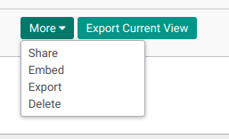
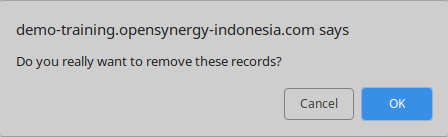

# Menghapus Reimbursement Type

## A. INPUT

*(Tidak ada instruksi khusus)*

## B. LANGKAH KERJA

1. Buka menu **Human Resource -> Configuration -> Reimbursement -> Reimbursement Type**. Abaikan jika sudah berada pada menu yang dimaksud.
2. Double klik pada data yang akan dihapus. Abaikan jika data sudah dipilih.
3. Klik tombol **More** pada bagian atas-tengah form.

4. Klik tombol **Delete** pada drop-down yang muncul dari tombol **More**.

5. Klik tombol **Ok** pada konfirmasi penghapusan yang muncul

## C. OUTPUT

* Data Reimbursement Type akan terhapus.

## Chapter
- [Konfigurasi](../../konfigurasi.md)
- [Penjelasan Reimbursement Type](./penjelasan.md)
- [Membuat Reimbursement Type](./membuat.md)
- [Memodifikasi Reimbursement Type](./memodifikasi.md)
- [Membuat Product Category](./membuat-product-category.md)
- [Menghapus Product Category](./menghapus-product-category.md)
- [Membuat Product](./membuat-product.md)
- [Menghapus Product](./menghapus-product.md)
