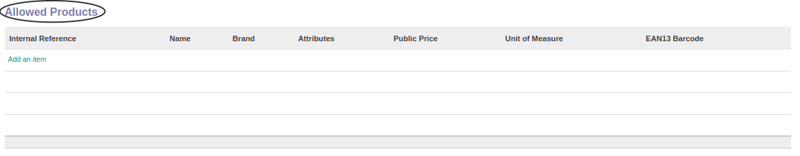
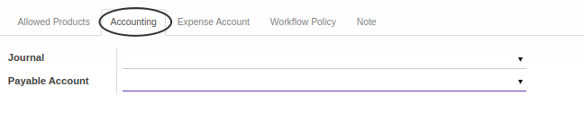
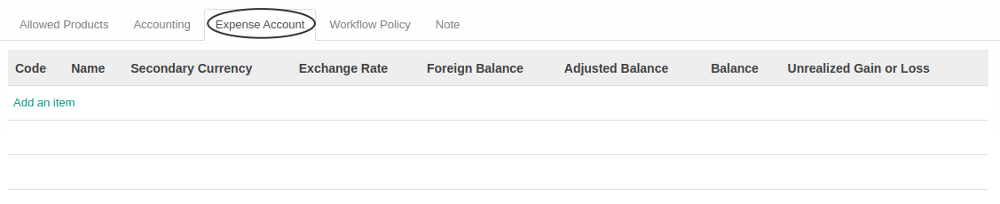

# Penjelasan Reimbursement Type

Informasi pada *Reimbursement Type* dibagi menjadi beberapa bagian, yaitu:

* [Header](#bagian-header)
* [Tab Allowed Products](#tab-allowed-product)
    * [Allowed Product Category](#tab-tab-allowed-product-category)
    * [Allowed Product](#tab-tab-allowed-product)
* [Tab Accounting](#tab-accounting)
* [Tab Expense Account](#tab-expense-account)
* [Tab Workflow Policy](#tab-workflow-policy)
* [Tab Note](#tab-note)

### <a name="bagian-header">HEADER</a>

#### <a name="field-name">Employee Reimbursement Type</a>

Nama Jenis Reimbursement Karyawan

#### <a name="field-code">Code</a>

Kode Jenis Reimbursement

#### <a name="field-active">Active</a>

Sebagai penanda apakah data adalah aktif/non-aktif

#### <a name="field-sequence">Sequence</a>

Sequence yang digunakan untuk mengenerate dokumen reimbursement. Pilihan diambil dari master data Sequence

### <a name="tab-allowed-product">TAB ALLOWED PRODUCTS</a>

### <a name="tab-tab-allowed-product-category">Allowed Product Category</a>

Kategori produk yang produk-produknya diperbolehkan dipilih ketika membuat reimbursement.

#### <a name="field-product-category-name">Name</a>

Nama kategori produk.

### <a name="tab-tab-allowed-product">Allowed Product</a>

Produk-produk yang diperbolehkan dipilih ketika membuat reimbursement

#### <a name="field-product-internal-reference">Internal Reference</a>

Referensi internal.

#### <a name="field-product-name">Name</a>

Nama produk.

#### <a name="field-product-brand">Brand</a>

Nama merk.

#### <a name="field-product-attributes">Attributes</a>

Atribut produk.

#### <a name="field-product-public-price">Public Price</a>

Harga publik.

#### <a name="field-product-uom">Unit of Measure</a>

Satuan ukuran.

#### <a name="field-product-ean13-barcode">EAN13 Barcode</a>

Kode batang EAN13.

### <a name="tab-accounting">TAB ACCOUNTING</a>

#### <a name="field-journal">Journal</a>

Buku jurnal yang akan digunakan pada pembuatan penjurnalan otomatis. Pilihan diambil dari master data Journal.

#### <a name="field-payable-account">Payable Account</a>

Akun utang yang akan digunakan pada pembuatan penjurnalan otomatis. Pilihan diambil dari master data Account.

### <a name="tab-expense-account">TAB EXPENSE ACCOUNT</a>

#### <a name="field-expense-account-code">Code</a>

Kode akun pengeluaran.

#### <a name="field-expense-account-name">Name</a>

Nama akun pengeluaran.

#### <a name="field-expense-account-secondary-currency">Secondary Currency</a>

Mata uang sekunder.

#### <a name="field-expense-account-exchange-rate">Exchange Rate</a>

Kurs.

#### <a name="field-expense-account-foreign-balance">Foreign Balance</a>

Saldo mata uang asing.

#### <a name="field-expense-account-adjusted-balance">Adjusted Balance</a>

Saldo yang disesuaikan.

#### <a name="field-expense-account-balance">Balance</a>

Saldo.

#### <a name="field-expense-account-gain-loss">Unrealized Gain or Loss</a>

Keuntungan atau kerugian yang belum direalisasi.

### <a name="tab-workflow-policy">TAB WORKFLOW POLICY</a>

#### <a name="field-confirm">Allow To Confirm Reimbursement</a>

Kelompok pengguna yang usernya diperbolehkan untuk mengkonfirmasi reimbursement.

#### <a name="field-restart-approval">Allow To Restart Reimbursement Approval</a>

Kelompok pengguna yang usernya diperbolehkan untuk merestart persetujuan reimbursement.

#### <a name="field-change">Allow To Change Reimbursement Detail</a>

Kelompok pengguna yang usernya diperbolehkan untuk merubah nilai reimbursement.

#### <a name="field-cancel">Allow To Cancel Reimbursement</a>

Kelompok pengguna yang usernya diperbolehkan untuk membatalkan reimbursement.

#### <a name="field-terminate">Allow To Terminate Reimbursement</a>

Kelompok pengguna yang usernya diperbolehkan untuk menterminasi reimbursement.

#### <a name="field-restart">Allow To Restart Reimbursement</a>

Kelompok pengguna yang usernya diperbolehkan untuk merestart reimbursement.

### <a name="tab-note">TAB NOTE</a>

#### <a name="field-note">Note</a>

Catatan atau Keterangan

## Chapter
- [Konfigurasi](../../konfigurasi.md)
- [Penjelasan Reimbursement Type](./penjelasan.md)
- [Membuat Reimbursement Type](./membuat.md)
- [Memodifikasi Reimbursement Type](./memodifikasi.md)
- [Menghapus Reimbursement Type](./menghapus.md)
- [Membuat Product Category](./membuat-product-category.md)
- [Menghapus Product Category](./menghapus-product-category.md)
- [Membuat Product](./membuat-product.md)
- [Menghapus Product](./menghapus-product.md)
