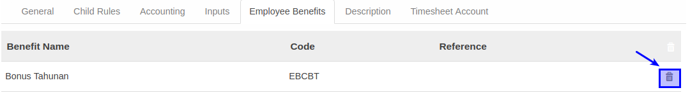
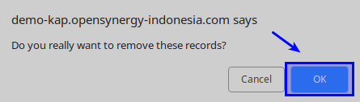

# Menghapus Employee Benefits

*(Instruksi kerja ini merupakan sub instruksi dari (1) [Membuat Salary Rules](./membuat.md), atau (2) [Memodifikasi Salary Rules](./memodifikasi.md). Instruksi kerja ini tidak bisa berdiri sendiri)*

## A. INPUT

*(Tidak ada prasyarat khusus)*

## B. INSTRUKSI KERJA

1. <a name="l2">Buka</a> tab **Employee Benefits**.
2. Pilih Data yang akan dihapus
3. Klik tombol **Hapus (Gambar Tong Sampah)** pada tabel **Employee Benefits**.

4. Klik OK pada untuk menghapus data employee benefits yang dipilih.

5. Ulangi [langkah ke-2](#l2) untuk menghapus data Employee Benefits.
6. Lanjutkan [langkah ke-14 instruksi Membuat Salary Rule](./membuat.md#l14) atau [langkah ke-15 instruksi Memodifikasi Salary Rule](./memodifikasi.md#l15).

## C. OUTPUT

*Data Employee Benefits akan terhapus*
