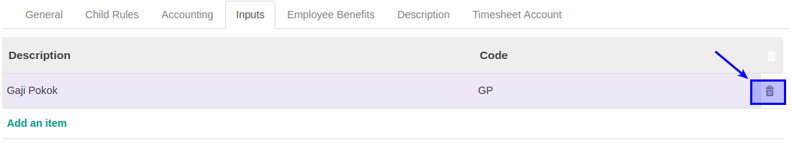
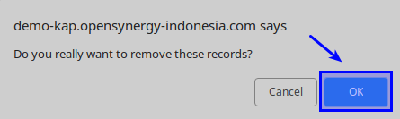

# Menghapus Inputs

*(Instruksi kerja ini merupakan sub instruksi dari (1) [Membuat Salary Rules](./membuat.md), atau (2) [Memodifikasi Salary Rules](./memodifikasi.md). Instruksi kerja ini tidak bisa berdiri sendiri)*

## A. INPUT

*(Tidak ada prasyarat khusus)*

## B. INSTRUKSI KERJA

1. <a name="l2">Buka</a> tab **Inputs**.
2. Pilih Data yang akan dihapus
3. Klik tombol **Hapus (Gambar Tong Sampah)** pada tabel **Inputs**.

4. Klik OK pada untuk menghapus data inputs yang dipilih.

5. Ulangi [langkah ke-2](#l2) untuk menghapus data Inputs.
6. Lanjutkan [langkah ke-13 instruksi Membuat Salary Rule](./membuat.md#tabinputs) atau [langkah ke-14 instruksi Memodifikasi Salary Rule](./memodifikasi.md#l14).

## C. OUTPUT

*Data Inputs akan terhapus*
