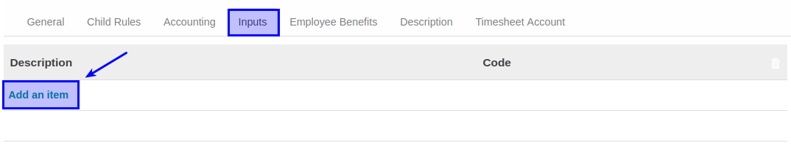

# Membuat Inputs

*(Instruksi kerja ini merupakan sub instruksi dari (1) [Membuat Salary Rules](./membuat.md), atau (2) [Memodifikasi Salary Rules](./memodifikasi.md). Instruksi kerja ini tidak bisa berdiri sendiri)*

## A. INPUT

*(Tidak ada prasyarat khusus)*

## B. INSTRUKSI KERJA

1. Buka tab **Inputs**.
2. <a name="l2">Klik</a> tombol **Add an Item** pada tabel **Inputs**.

3. Isi **[Description](./penjelasan.md#field-inputs-description)**. Harus diisi.
4. Isi **[Code](./penjelasan.md#field-inputs-code)**. Tidak Harus diisi.
5. Ulangi [langkah ke-2](#l2) untuk menambahkan Inputs.
6. Lanjutkan [langkah ke-13 instruksi Membuat Salary Rule](./membuat.md#tabinputs) atau [langkah ke-14 instruksi Memodifikasi Salary Rule](./memodifikasi.md#l14).

## C. OUTPUT

*(Tidak ada instruksi khusus)*
