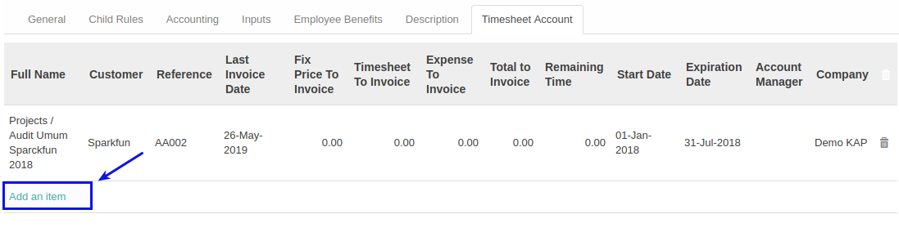
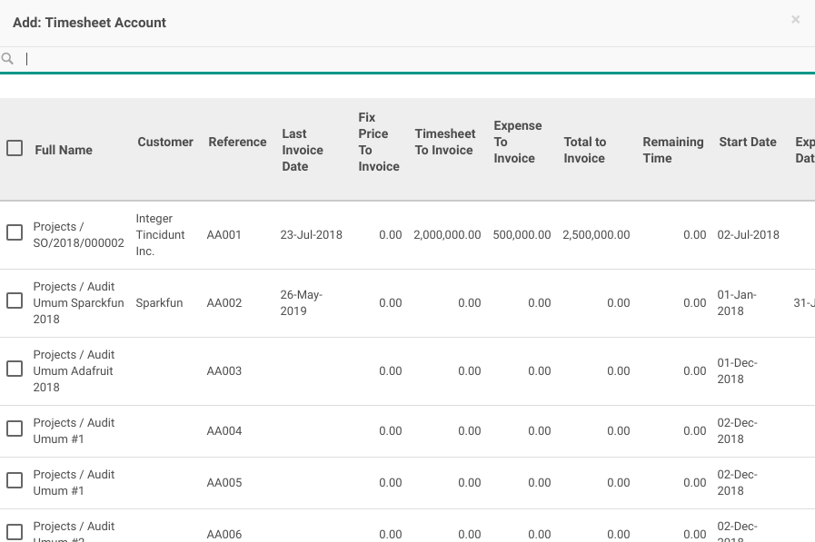
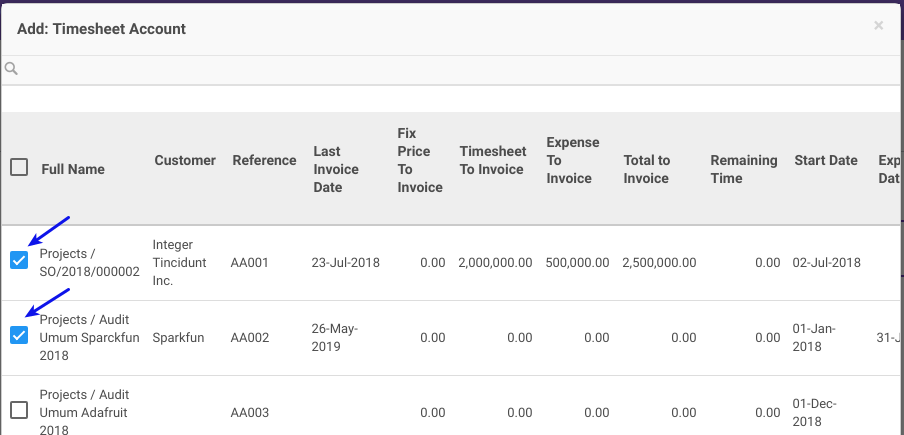

# Membuat Timesheet Account

*(Instruksi kerja ini merupakan sub instruksi dari (1) [Membuat Salary Rules](./membuat.md), atau (2) [Memodifikasi Salary Rules](./memodifikasi.md). Instruksi kerja ini tidak bisa berdiri sendiri)*

## A. INPUT

*(Tidak ada prasyarat khusus)*

## B. INSTRUKSI KERJA

1. Buka tab **Timesheet Account**.
2. <a name="l2">Klik</a> tombol **Add an Item** pada tabel **Timesheet Account**.

3. Selanjutny akan muncul pilihan **[Timesheet Account](./penjelasan.md#tab-timesheet-account)**.

4. Centang **Account** yang diperbolehkan.

5. Klik Select pada bagian bawah kiri jika ada account yang dipilih.

6. Ulangi [langkah ke-2](#l2) untuk menambahkan Account.
7. Lanjutkan [langkah ke-16 instruksi Membuat Salary Rule](./membuat.md#l16) atau [langkah ke-17 instruksi Memodifikasi Salary Rule](./memodifikasi.md#l17).

## C. OUTPUT

*(Tidak ada instruksi khusus)*
