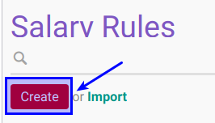

# Membuat Salary Rule

## A. INPUT

*(Tidak ada instruksi khusus)*

## B. LANGKAH KERJA

1. Buka menu **Human Resource -> Configuration -> Payroll -> Salary Rules**. Abaikan jika sudah berada pada menu yang dimaksud.
2. Klik tombol **Create** pada bagian atas-kiri form.

3. Isi **[Name](./penjelasan.md#field-name)**. Harus diisi.
4. Pilih **[Category](./penjelasan.md#field-category-id)**. Harus diisi.
5. Isi **[Code](./penjelasan.md#field-code)**. Harus diisi.
6. Isi **[Sequence](./penjelasan.md#field-sequence)**. Tidak Harus diisi.
7. Aktifkan **[Active](./penjelasan.md#field-active)** jika dibutuhkan.
8. Centang **[Appears on Payslip](./penjelasan.md#field-appears-payslip)** jika dibutuhkan.
9. Pilih **[Company](./penjelasan.md#field-company)**. Tidak Harus diisi.
10. Buka **[Tab General](./penjelasan.md#tab-general)**.
    - Isi bagian **[Conditions](./penjelasan.md#bagian-conditions)**. Harus diisi.
    - Isi bagian **[Computations](./penjelasan.md#bagian-computations)**. Harus diisi.
    - Pilih **[Contribution Register](./penjelasan.md#bagian-company-contribution)**. Tidak Harus diisi.
11. Buka **Tab Child Rules**  ##TODO
    - <a name="l15">[Tambahkan](./membuat-child-rules.md)/[Hapus](./hapus-child-rules.md)</a> **Child Rules**.
12. Buka **Tab Accounting**
    - Pilih **[Debit Account](./penjelasan.md#field-debit-account)**. Tidak Harus diisi.
    - Pilih **[Credit Account](./penjelasan.md#field-credit-account)**. Tidak Harus diisi.
    - Pilih **[Analytic Account](./penjelasan.md#field-analytic-account)**. Tidak Harus diisi.
    - Pilih **[Tax Code](./penjelasan.md#field-tax-code)**. Tidak Harus diisi.
13. <a name="tabinputs">Buka </a> **[Tab Inputs](./penjelasan.md#tab-inputs)**.
    - [Tambahkan](./membuat-inputs.md)/[Modifikasi](./modifikasi-inputs.md)/[Hapus](./hapus-inputs.md) **Inputs**.
14. Buka **Tab Employee Benefits**
    - <a name="l14">[Tambahkan](./membuat-employee-benefits.md)/[Hapus](./hapus-employee-benefits.md)</a> **Employee Benefits**.
15. Buka **Tab Description**
    - Isi **[Description](./penjelasan.md#field-description)**. Tidak Harus diisi.
16. Buka **Tab Timesheet Account**
    - <a name="l16">[Tambahkan](./membuat-timesheet-account.md)/[Hapus](./hapus-timesheet-account.md)</a> **Timesheet Account**.
17. Jika akan **disimpan** Klik tombol **Save** pada bagian atas-kiri form.

## C. OUTPUT

*(Tidak ada instruksi khusus)*
