# Penjelasan

Informasi pada Salary Rule dibagi menjadi beberapa area, diantaranya:

### <a name="bagian-header">HEADER</a>

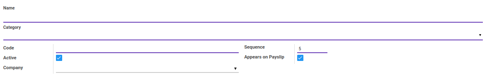

#### <a name="field-name">Name</a>

Nama *Salary Rule*

#### <a name="field-category-id">Category</a>

Kategori *Salary Rule*

#### <a name="field-code">Code</a>

Kode *Salary Rule*

#### <a name="field-sequence">Sequence</a>

No. Urut

#### <a name="field-active">Active</a>

Sebagai penanda apakah data adalah aktif/non-aktif

#### <a name="field-appears-payslip">Appears on Payslip</a>

Jika dicentang, maka data *Salary Rule* akan tampil pada *Payslip*

#### <a name="field-company">Company</a>

Mendefinisikan perusaahan

### <a name="tab-general">TAB GENERAL</a>

Informasi pada Tab General dibagi menjadi beberapa area, diantaranya:

* [Conditions](#bagian-conditions)
* [Computations](#bagian-computations)
* [Company Contribution](#bagian-company-contribution)

### <a name="bagian-conditions">Conditions</a>

Isian *Conditions* terbagi atas 3 pilihan, yaitu: 
* **Always True:** Kondisi yang memiliki kriteria dimana nilainya selalu *True*
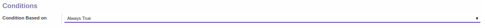

* **Range:** Kondisi yang memiliki kriteria berdasarkan rentang/jarak(*Range*)
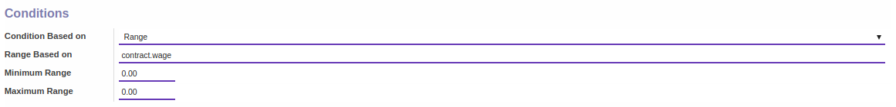
**PENJELASAN:**
    - **Range Based On:** Mendefinisikan kriteria dasar kondisi yang akan digunakan
    - **Minimum Range:** Mendefinisikan nilai minimal rentang/jarak(*Range*)
    - **Maximum Range:** Mendefinisikan nilai maximal rentang/jarak(*Range*)

* **Python Expression:** Kondisi yang memiliki kriteria berdasarkan kode python
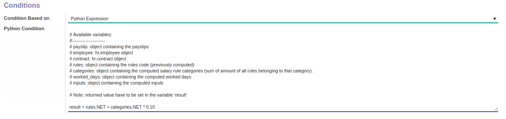
**PENJELASAN:**
    - **Python Condition:** Mendefiniskan kode python

### <a name="bagian-computations">Computations</a>

Isian *Computations* terbagi atas 3 pilihan, yaitu: 
* **Percentage (%):** Perhitungan menggunakan persentase
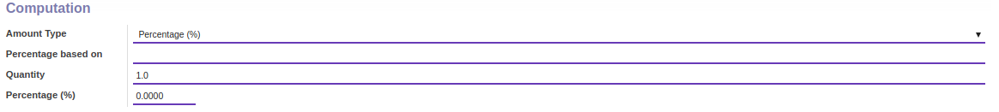
**PENJELASAN:**
    - **Percentage based on:** Mendefinisikan kriteria dasar persentase yang akan digunakan
    - **Quantity:** Mendefinisikan jumlah kuantitas
    - **Percentage (%):** Mendefinisikan nilai persentase

* **Fixed Amount:** Perhitungan menggunakan nilai pasti(*Fixed*)
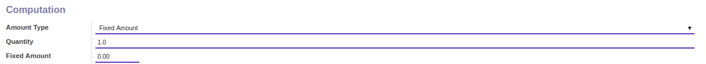
**PENJELASAN:**
    - **Quantity:** Mendefinisikan jumlah kuantitas
    - **Fixed Amount:** Mendefinisikan jumlah nilai pasti(*Fixed*)

* **Python Code:** Perhitungan menggunakan python code
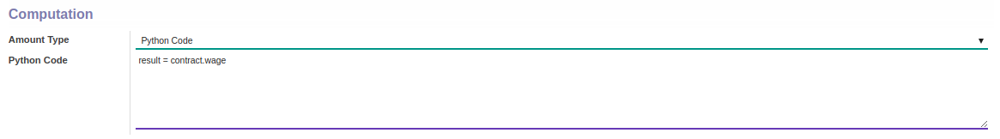
**PENJELASAN:**
    - **Python Code:** Mendefiniskan kode python

### <a name="bagian-company-contribution">Company Contribution</a>

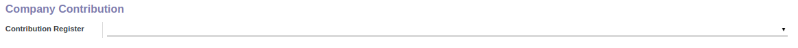

#### <a name="field-contribution-register">Contribution Register</a>

#TODO

### <a name="tab-child-rules">TAB CHILD RULES</a>

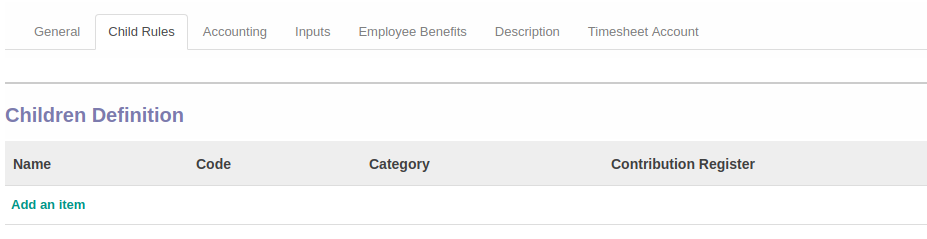

#### <a name="field-children-definition">Children Definition</a>

#TODO

### <a name="tab-accounting">TAB ACCOUNTING</a>

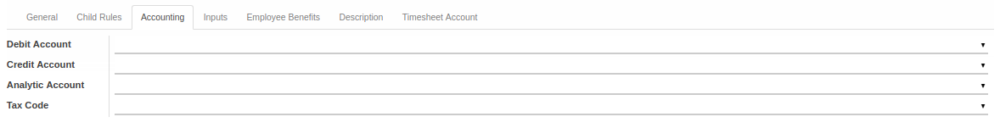

#### <a name="field-debit-account">Debit Account</a>

Mendefinisikan akun debet yang akan digunakan

#### <a name="field-credit-account">Credit Account</a>

Mendefinisikan akun kredit yang akan digunakan

#### <a name="field-analytic-account">Analytic Account</a>

Mendefinisikan akun analitik yang akan digunakan

#### <a name="field-tax-code">Tax Code</a>

Mendefinisikan pajak yang akan digunakan

### <a name="tab-inputs">TAB INPUTS</a>

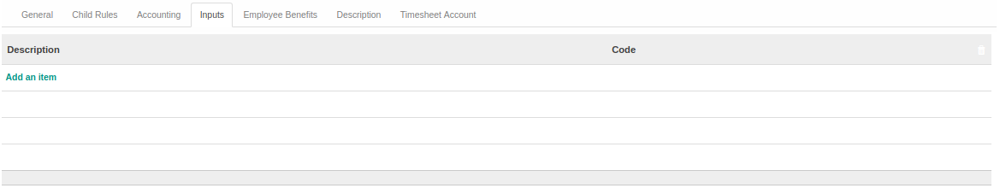

#### <a name="field-inputs-description">Description</a>

Deskripsi *Input*

#### <a name="field-inputs-code">Code</a>

Kode *Input*

### <a name="tab-employee-benefits">TAB EMPLOYEE BENEFITS</a>

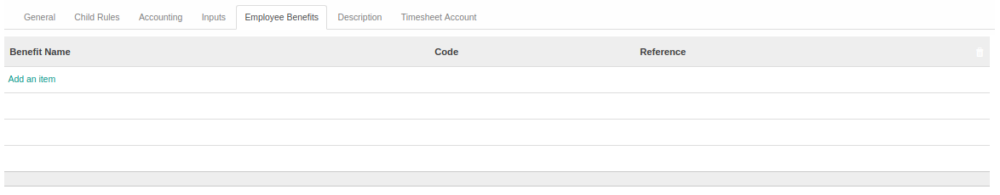

#### <a name="field-employee-benefit">Employee Benefits</a>

Mendefinisikan tunjangan karyawan yang akan diperoleh

### <a name="tab-description">TAB DESCRIPTION</a>

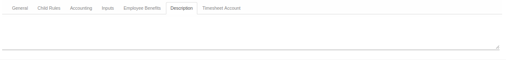

#### <a name="field-description">Description</a>

Mendefinisikan deskripsi terkait *Salary Rule*

### <a name="tab-timesheet-account">TAB TIMESHEET ACCOUNT</a>

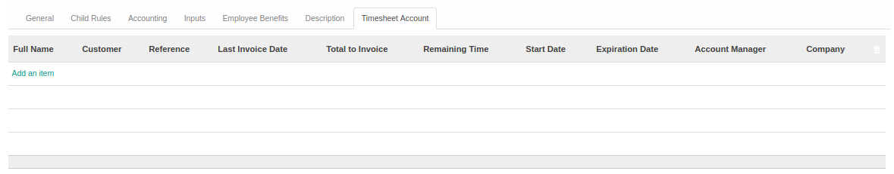

#### <a name="field-timeheet-account">Timesheet Account</a>

Mendefinisikan *Timesheet Account*
