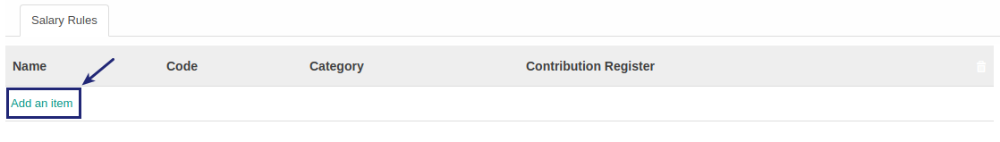
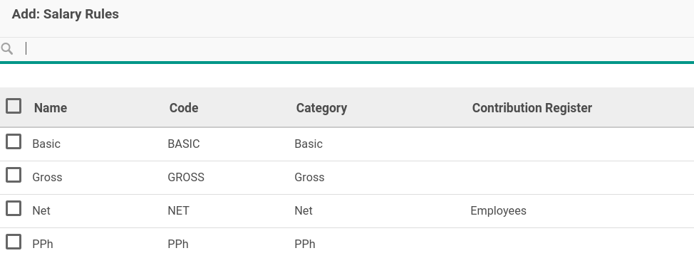
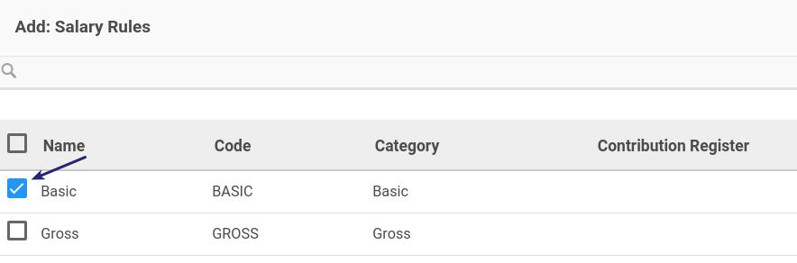
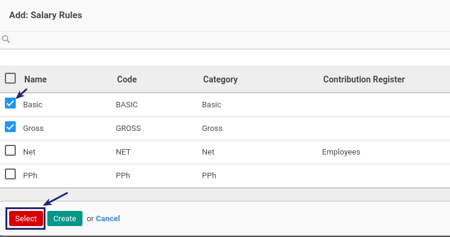

# Menambah Item Salary Rule

*(Instruksi kerja ini merupakan sub instruksi dari (1) [Membuat Salary Structure](./membuat.md), atau (2) [Memodifikasi Salary Structure](./memodifikasi.md). Instruksi kerja ini tidak bisa berdiri sendiri)*

## A. INPUT

*(Tidak ada prasyarat khusus)*

## B. INSTRUKSI KERJA

1. Buka tab **Salary Rules**.
2. <a name="l2">Klik</a> tombol **Add an Item** pada tab **Salary Rule**.

3. Selanjutny akan muncul pilihan **[Salary Rule](./penjelasan.md#tab-salary-rule)**.

4. Centang **Salary Rule** yang diperbolehkan.

5. Klik Select pada bagian bawah kiri jika ada salary rule yang dipilih.

6. Ulangi [langkah ke-2](#l2) untuk menambahkan Salary Rule.
7. Lanjutkan [langkah ke-7 instruksi Membuat Salary Structure](./membuat.md#l7) atau [langkah ke-8 instruksi Memodifikasi Salary Structure](./memodifikasi.md#l8).

## C. OUTPUT

*(Tidak ada instruksi khusus)*
