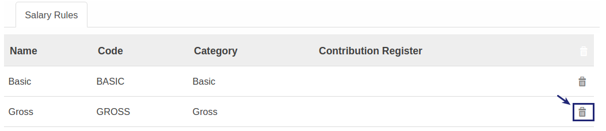
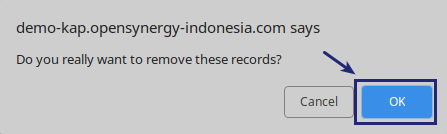

# Menghapus Item Salary Rule

*(Instruksi kerja ini merupakan sub instruksi dari (1) [Membuat Salary Structure](./membuat.md), atau (2) [Memodifikasi Salary Structure](./memodifikasi.md). Instruksi kerja ini tidak bisa berdiri sendiri)*

## A. INPUT

*(Tidak ada prasyarat khusus)*

## B. INSTRUKSI KERJA

1. <a name="l2">Buka</a> tab **Salary Rule**.
2. Pilih Data yang akan dihapus
3. Klik tombol **Hapus (Gambar Tong Sampah)** pada tabel **Salary Rule**.

4. Klik OK pada untuk menghapus data Salary Rule yang dipilih.

5. Ulangi [langkah ke-2](#l2) untuk menghapus data Salary Rule.
6. Lanjutkan [langkah ke-7 instruksi Membuat Salary Structure](./membuat.md#l7) atau [langkah ke-8 instruksi Memodifikasi Salary Structure](./memodifikasi.md#l8).

## C. OUTPUT

*Data Inputs akan terhapus*
