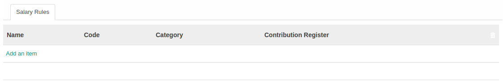

# Penjelasan Salary Structure

Informasi pada Salary Structure dibagi menjadi beberapa area, diantaranya:

### <a name="bagian-header">HEADER</a>

#### <a name="field-name">Name</a>

Nama *Salary Structure/Struktur Gaji*

#### <a name="field-parent">Parent</a>

Parent dari *Salary Structure/Struktur Gaji*

#### <a name="field-reference">Refrence</a>

Referensi untuk *Salary Structure/Struktur Gaji*

#### <a name="field-company">Company</a>

Mendefinisikan nama perusaahan

### <a name="tab-general">TAB SALARY RULE</a>

#### <a name="field-name-salary-rule">Name</a>

Nama *Salary Rule*

#### <a name="field-code">Code</a>

Kode *Salary Rule*

#### <a name="field-category-id">Category</a>

Kategori *Salary Rule*

#### <a name="field-contribution-register">Contribution Register</a>

Mendefiniskan Contribution Register

## Kembali ke menu Salary Structure

[Kembali ke menu Salary Structure](../salary-structure.md)
