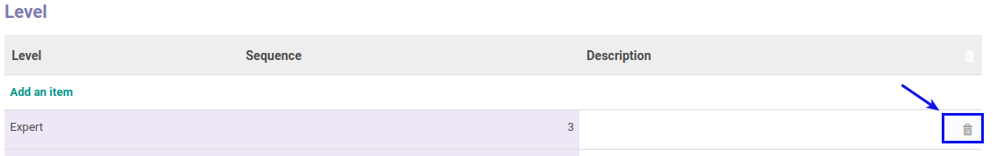

# Menghapus Level

*(Instruksi kerja ini merupakan sub instruksi dari (1) [Membuat Skill](./membuat.md), atau (2) [Memodifikasi Skill](./memodifikasi.md). Instruksi kerja ini tidak bisa berdiri sendiri)*

## A. INPUT

*(Tidak ada prasyarat khusus)*

## B. INSTRUKSI KERJA

1. Buka tab **Level**.
2. <a name="l2">Klik</a> gambar **tong sampah** pada data yang akan dihapus pada tabel **Level**.

3. Ulangi [langkah ke-2](#l2) untuk menghapus Level.
4. Lanjutkan [langkah ke-9 instruksi Membuat Skill](./membuat.md#l9) atau [langkah ke-10 instruksi Memodifikasi Skill](./memodifikasi.md#l10).

## C. OUTPUT

*Data Level akan terhapus*
