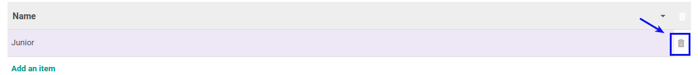

# Menghapus Sub Skill

*(Instruksi kerja ini merupakan sub instruksi dari (1) [Membuat Skill](./membuat.md), atau (2) [Memodifikasi Skill](./memodifikasi.md). Instruksi kerja ini tidak bisa berdiri sendiri)*

## A. INPUT

*(Tidak ada prasyarat khusus)*

## B. INSTRUKSI KERJA

1. Buka tab **Sub Skill**.
2. <a name="l2">Klik</a> gambar **tong sampah** pada data yang akan dihapus pada tabel **Sub Skill**.

3. Ulangi [langkah ke-2](#l2) untuk menghapus Sub Skill.
4. Lanjutkan [langkah ke-7 instruksi Membuat Skill](./membuat.md#l7) atau [langkah ke-8 instruksi Memodifikasi Skill](./memodifikasi.md#l8).

## C. OUTPUT

*Data Sub Skill akan terhapus*
