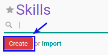

# Membuat Skill

## A. INPUT

*(Tidak ada instruksi khusus)*

## B. LANGKAH KERJA

1. Buka menu **Human Resource -> Configuration -> Skill Management - Skills**. Abaikan jika sudah berada pada menu yang dimaksud.
2. Klik tombol **Create** pada bagian atas-kiri form.

3. Isi **[Name](./penjelasan.md#field-name)**. Harus diisi.
4. Centang **[Active](./penjelasan.md#field-active)**. jika diperlukan.
5. Pilih **[Parent](./penjelasan.md#field-parent-id)**. Tidak Harus diisi.
6. Buka **[Tab Sub Skill](./penjelasan.md#tab-sub-skill)** . Tab ini jarang sekali digunakan karena biasanya digunakan dengan mengisi parent
7. <a name="l7">[Tambahkan](./membuat-sub-skill.md)/[Modifikasi](./modifikasi-sub-skill.md)/[Hapus](./hapus-sub-skill.md)</a>  **Sub Skill**.
8. Buka **[Tab Level](./penjelasan.md#tab-level)** .
9. <a name="l9">[Tambahkan](./membuat-level.md)/[Modifikasi](./modifikasi-level.md)/[Hapus](./hapus-level.md)</a>  **Level**.
10. Jika akan **disimpan** Klik tombol **Save** pada bagian atas-kiri form.

## C. OUTPUT

*(Tidak ada instruksi khusus)*
