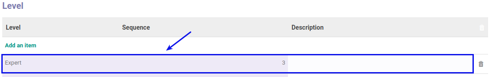

# Memodifikasi Level

*(Instruksi kerja ini merupakan sub instruksi dari (1) [Membuat Skill](./membuat.md), atau (2) [Memodifikasi Skill](./memodifikasi.md). Instruksi kerja ini tidak bisa berdiri sendiri)*

## A. INPUT

*(Tidak ada prasyarat khusus)*

## B. INSTRUKSI KERJA

1. Buka tab **Level**.
2. <a name="l2">Double Klik</a> pada data yang akan diedit pada tabel **Level**.

3. Isi dan sesuaikan **[Level](./penjelasan.md#field-level)**. Harus diisi.
4. Isi dan sesuaikan **[Sequence](./penjelasan.md#field-sequence)**. Harus diisi.
5. Isi dan sesuaikan **[Description](./penjelasan.md#field-description)**. Tidak Harus diisi.
6. Ulangi [langkah ke-2](#l2) untuk memodifikasi Level.
7. Lanjutkan [langkah ke-9 instruksi Membuat Skill](./membuat.md#l9) atau [langkah ke-10 instruksi Memodifikasi Skill](./memodifikasi.md#l10).

## C. OUTPUT

*(Tidak ada instruksi khusus)*
