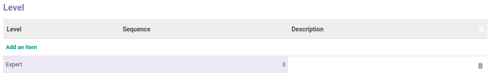

# Penjelasan Skill

Informasi pada Menu Skill dibagi menjadi beberapa area, diantaranya:

* [Header](#bagian-header)
* [Tab Sub Skill](#tab-sub-skill)
* [Tab Public Level](#tab-level)

### <a name="bagian-header">HEADER</a>

#### <a name="field-name">Name</a>

Nama skill/keahlian

#### <a name="field-active">Active</a>

Sebagai penanda apakah data adalah aktif/non-aktif

#### <a name="field-parent-id">Name</a>

Parent/induk dari skill

### <a name="tab-sub-skill">TAB SUB SKILL</a>

*Pada prakteknya prosedur menambah/memodifikasi/menghapus data sub skill hampir tidak pernah dilakukan melalui tab ini*

#### <a name="field-name-sub">Name</a>

Nama sub skill/keahlian

### <a name="tab-level">TAB LEVEL</a>

#### <a name="field-level">Level</a>

Nama level

#### <a name="field-sequence">Sequence</a>

Definisikan nomor urut/sequence

#### <a name="field-description">Description</a>

Definisikan keterangan/catatan mengenai level
