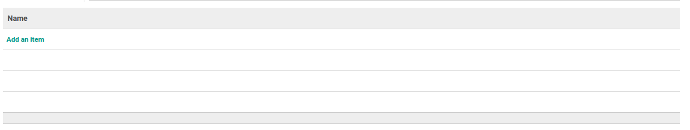

# Penjelasan

### <a name="bagian-header">HEADER</a>

#### <a name="field-name">Name</a>

Nama skill/keahlian

#### <a name="field-active">Active</a>

Sebagai penanda apakah data adalah aktif/non-aktif

#### <a name="field-parent-id">Name</a>

Parent/induk dari skill

### <a name="bagian-header">DETAILS</a>

#TODO
