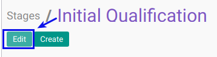

# Memodifikasi Stages Recruitment

## A. INPUT

*(Tidak ada instruksi khusus)*

## B. LANGKAH KERJA

1. Buka menu **Human Resource -> Configuration -> Recruitment -> Stages**. Abaikan jika sudah berada pada menu yang dimaksud.
2. Double klik pada data yang akan diedit
3. Klik tombol **Edit** pada bagian atas-kiri form.

4. Isi dan sesuaikan **[Name](./penjelasan.md#field-name)**. Harus diisi.
5. Isi dan sesuaikan **[Sequence](./penjelasan.md#field-sequence)**. Tidak Harus diisi.
6. Pilih dan sesuaikan **[Spesific to department](./penjelasan.md#field-department)**. Tidak Harus diisi.
7. Centang dan sesuaikan **[Folded in kanban view](./penjelasan.md#field-kanban)** jika dibutuhkan.
8. Pilih dan sesuaikan **[Use Template](./penjelasan.md#field-template)**. Tidak Harus diisi.
9. Isi dan sesuaikan **[Requirement](./penjelasan.md#field-requirement)**. Tidak Harus diisi.
10. Jika akan **disimpan** Klik tombol **Save** pada bagian atas-kiri form.

## C. OUTPUT

*(Tidak ada instruksi khusus)*
