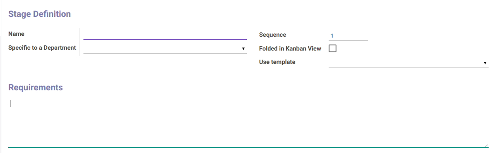

# Penjelasan Stages

### <a name="bagian-header">HEADER</a>

### Stage definition

#### <a name="field-name">Name</a>

Nama urutan/**stages**

#### <a name="field-sequence">Sequence</a>

Nomor urut/sequence

#### <a name="field-department">Specific to a department</a>

Definisikan nama departemen jika dikhususkan untuk departemen tertentu

#### <a name="field-kanban">Folded in Kanban View</a>

Sebagai penanda jika data akan dimasukkan dalan tampilan kanban

#### <a name="field-template">Use Template</a>

Definisikan jika menggunakan template

### Requirement

#### <a name="field-requirement">Requirement</a>

Catatan/deskripsi mengenai persyaratan/requirement
