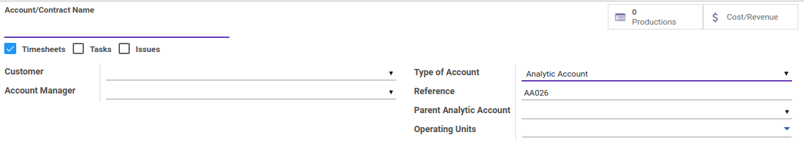
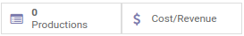
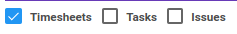
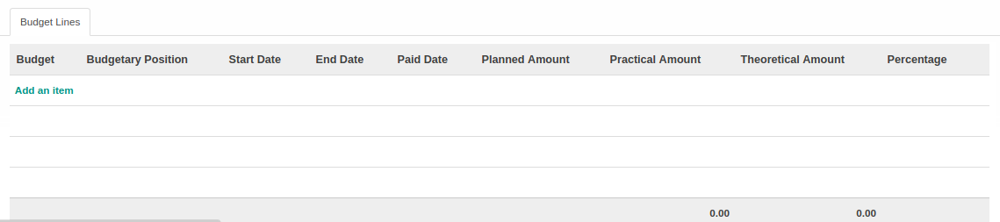

# Penjelasan

### <a name="bagian-header">HEADER</a>

#### <a name="field-name">Account/Contract Name</a>

Nama akun/kontrak timesheet

#### <a name="field-smart-button">Smart Button</a>

 

Tombol-tombol yang berfungsi sebagai *Shortcut* untuk masuk ke dalam menu yang berkaitan dan juga sebagai pemberi informasi mengenai seberapa banyak data, total, dll  

#### <a name="field-timesheet-options">Options</a>

 

* **Timesheets:** Jika dicentang, maka data timesheet account akan dapat digunakan pada **Timesheets**
* **Tasks:** Jika dicentang, maka data timesheet account akan dapat digunakan pada **Tasks**
* **Issues:** Jika dicentang, maka data timesheet account akan dapat digunakan pada **Issues**

#### <a name="field-partner-id">Customer</a>

Mendefinisikan konsumen

#### <a name="field-account-manager">Account Manager</a>

Mendefinisikan manajer akun

#### <a name="field-type">Type of Account</a>

Tipe akun. Terbagi atas 4 pilihan, yaitu: 
* **Analytic View**
* **Analytic Account**
* **Contract or Project**
* **Template or Contract**

#### <a name="field-code">Reference</a>

Mendefinisikan referensi yang digunakan

#### <a name="field-parent-id">Parent Analytic Account</a>

Mendefinisikan parent/induk dari akun analitik

#### <a name="field-operating-unit-ids">Operating Units</a>

Mendefinisikan operating unit
> **Catatan:** Isian ini hanya untuk user yang memiliki group **Multi Operating Unit**

### <a name="bagian-budget-lines">BUDGET LINES</a>

 

#### <a name="budget-lines-field-crossovered-budget-id">Budget</a>

#TODO

#### <a name="budget-lines-field-general-budget-id">Budgetary Position</a>

#TODO

#### <a name="budget-lines-field-start-date">Start Date</a>

#TODO

#### <a name="budget-lines-field-end-date">End Date</a>

#TODO

#### <a name="budget-lines-field-paid-date">Paid Date</a>

#TODO

#### <a name="budget-lines-field-practical-amount">Practical Amount</a>

#TODO

#### <a name="budget-lines-field-practical-amount">Theoritical Amount</a>

#TODO

#### <a name="budget-lines-field-percentage">Percentage</a>

#TODO