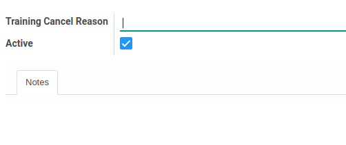

# Penjelasan Training Cancel Reason

### <a name="bagian-header">HEADER</a>

#### <a name="field-name">Training Cancel Reason</a>

Definisikan nama alasan pembatalan pelatihan

#### <a name="field-active">Active</a>

Sebagai penanda apakah data adalah aktif/non-aktif

#### <a name="field-notes">Notes</a>

Isikan catatan alasan pembatalan pelatihan untuk menjelaskan lebih detail
