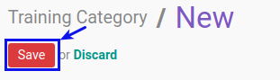

# Membuat Training Category

## A. INPUT

*(Tidak ada instruksi khusus)*

## B. LANGKAH KERJA

1. Buka menu **Human Resource -> Configuration -> Training -> Training Category**. Abaikan jika sudah berada pada menu yang dimaksud.
2. Klik tombol **Create** pada bagian atas-kiri form.

3. Isi **[Code](./penjelasan.md#field-code)**. Harus diisi.
4. Isi **[Training Category](./penjelasan.md#field-training-category)**. Harus diisi.
5. Centang **[Active](./penjelasan.md#field-active)** jika training category ini berstatus aktif. Tidak Harus diisi.
6. Pilih **[Type](./penjelasan.md#field-type)**. Harus diisi.
7. Pilih **[Parent](./penjelasan.md#field-parent)**. Tidak Harus diisi.
8. Pilih **[Training Allowance Pricelist](./penjelasan.md#field-allowance)**. Tidak Harus diisi.
9. Klik **[Tab Notes](./penjelasan.md#tab-note)**.
    - Isi **[Notes](./penjelasan.md#field-note)**. Tidak Harus diisi.
10. Klik **[Tab Evaluation](./penjelasan.md#tab-evaluation)**.
    - Pilih **[Pre Evaluation Survey](./penjelasan.md#field-pre-evaluation)**. Tidak Harus diisi.
    - Pilih **[Post Evaluation Survey](./penjelasan.md#field-post-evaluation)**. Tidak Harus diisi.
11. Jika akan **disimpan** Klik tombol **Save** pada bagian atas-kiri form.

## C. OUTPUT

*(Tidak ada instruksi khusus)*
