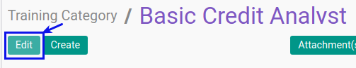
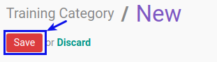

# Memodifikasi Training Category

## A. INPUT

*(Tidak ada instruksi khusus)*

## B. LANGKAH KERJA

1. Buka menu **Human Resource -> Configuration -> Training -> Training Category**. Abaikan jika sudah berada pada menu yang dimaksud.
2. Double klik pada data yang akan diedit
3. Klik tombol **Edit** pada bagian atas-kiri form.

4. Isi dan sesuaikan **[Code](./penjelasan.md#field-code)** jika diperlukan. Harus diisi.
5. Isi dan sesuaikan **[Training Category](./penjelasan.md#field-training-category)** jika diperlukan. Harus diisi.
6. Centang dan sesuaikan **[Active](./penjelasan.md#field-active)** jika training category ini berstatus aktif. Tidak Harus diisi.
7. Pilih dan sesuaikan **[Type](./penjelasan.md#field-type)** jika diperlukan. Harus diisi.
8. Pilih dan sesuaikan **[Parent](./penjelasan.md#field-parent)** jika diperlukan. Tidak Harus diisi.
9. Pilih dan sesuaikan **[Training Allowance Pricelist](./penjelasan.md#field-allowance)** jika diperlukan. Tidak Harus diisi.
10. Klik **[Tab Notes](./penjelasan.md#tab-note)**.
    - Isi dan sesuaikan **[Notes](./penjelasan.md#field-note)** jika diperlukan. Tidak Harus diisi.
11. Klik **[Tab Evaluation](./penjelasan.md#tab-evaluation)**.
    - Pilih dan sesuaikan **[Pre Evaluation Survey](./penjelasan.md#field-pre-evaluation)** jika diperlukan. Tidak Harus diisi.
    - Pilih dan sesuaikan **[Post Evaluation Survey](./penjelasan.md#field-post-evaluation)** jika diperlukan. Tidak Harus diisi.
12. Jika akan **disimpan** Klik tombol **Save** pada bagian atas-kiri form.

## C. OUTPUT

*(Tidak ada instruksi khusus)*
