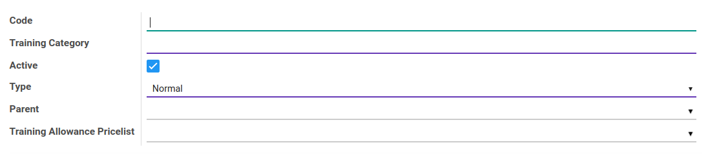
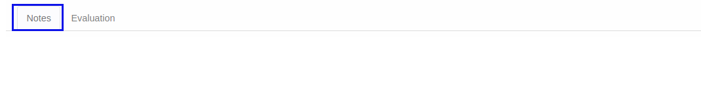
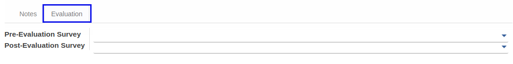

# Penjelasan Training Category

Informasi pada menu training category dibagi menjadi beberapa area, diantaranya:

* [Header](#bagian-header)
* [Tab Note](#tab-note)
* [Tab Evaluation](#tab-evaluation)

### <a name="bagian-header">HEADER</a>

#### <a name="field-code">Code</a>

Definisikan Kode training category

#### <a name="field-training-category">Training Category</a>

Definisikan Nama training category

#### <a name="field-active">Active</a>

Sebagai penanda apakah data adalah aktif/non-aktif

#### <a name="field-type">Type</a>

Tipe dari training kategory (View / Normal)

- View jika kategori training merupakan parent atau view saja (Biasanya digunakan untuk pengelompokkan)
- Normal jika kategori training dapat dipilih sebagai kategori training

#### <a name="field-parent">Parent</a>

Pilih parent dari training kategori (merupakan list training kategori)

#### <a name="field-allowance">Training Allowance Pricelist</a>

Pilih pricelist untuk allowance pelatihan  

### <a name="tab-note">TAB NOTE</a>

#### <a name="field-notes">Notes</a>

Isikan catatan untuk kategori pelatihan untuk menjelaskan lebih detail

### <a name="tab-evaluation">TAB EVALUATION</a>

Bisanya hanya diisi jika untuk training kategory bertipe **Normal**

#### <a name="field-pre-evaluation">Pre Evaluation Survey</a>

Pilih survey/test yang harus dilakukan sebelum dilakukan pelatihan

#### <a name="field-post-evaluation">Post Evaluation Survey</a>

Pilih survey/test yang harus dilakukan setelah pelatihan dilaksanakan
