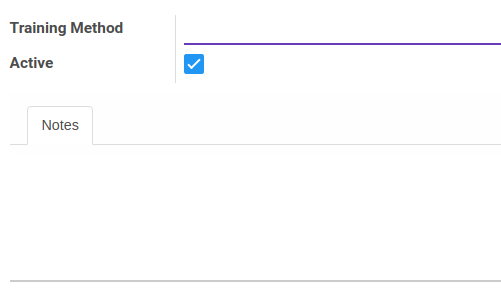

# Penjelasan Training Method

### <a name="bagian-header">HEADER</a>

#### <a name="field-name">Training Method</a>

Definisikan Nama metode training

#### <a name="field-active">Active</a>

Sebagai penanda apakah data adalah aktif/non-aktif

#### <a name="field-note">Notes</a>

Isikan catatan mengenai metode pelatihan
