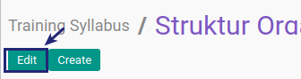

# Memodifikasi Training Syllabus

## A. INPUT

*(Tidak ada instruksi khusus)*

## B. LANGKAH KERJA

1. Buka menu **Human Resource -> Configuration -> Training -> Training Syllabus**. Abaikan jika sudah berada pada menu yang dimaksud.
2. Double klik pada data yang akan diedit
3. Klik tombol **Edit** pada bagian atas-kiri form.

4. Isi **[Training Syllabus](./penjelasan.md#field-name)**. Harus diisi.
5. Centang **[Active](./penjelasan.md#field-active)** jika training syllabus ini berstatus aktif. Tidak Harus diisi.
6. Isi **[Notes](./penjelasan.md#field-notes)**. Tidak Harus diisi.
7. Jika akan **disimpan** Klik tombol **Save** pada bagian atas-kiri form.

## C. OUTPUT

*(Tidak ada instruksi khusus)*
