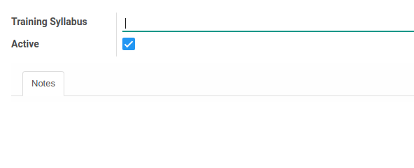

# Penjelasan Training Syllabus

### <a name="bagian-header">HEADER</a>

#### <a name="field-name">Training Syllabus</a>

Definisikan nama silabus pelatihan

#### <a name="field-active">Active</a>

Sebagai penanda apakah data adalah aktif/non-aktif

#### <a name="field-notes">Notes</a>

Isikan catatan silabus pelatihan untuk menjelaskan lebih detail
