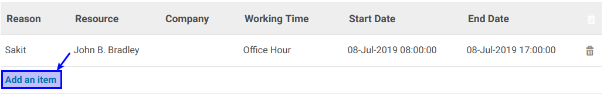
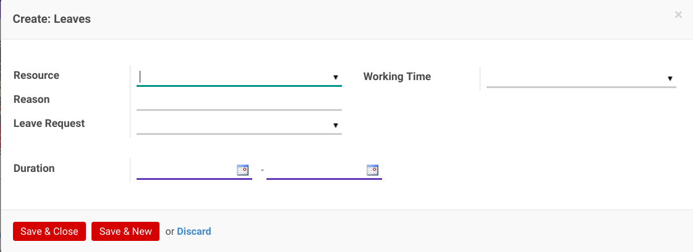

# Membuat Reason Leave

*(Instruksi kerja ini merupakan sub instruksi dari (1) [Membuat working Time](./membuat.md), atau (2) [Memodifikasi Working Time](./memodifikasi.md). Instruksi kerja ini tidak bisa berdiri sendiri)*

## A. INPUT

*(Tidak ada prasyarat khusus)*

## B. INSTRUKSI KERJA

1. Buka tab **Reason**.
2. <a name="l2">Klik</a> tombol **Add an Item** pada tabel **Reason**.

3. Selanjutnya akan muncul layar untuk input data reason leave.

4. Pilih **[Resource](./penjelasan.md#field-reason-resource)**. Tidak Harus diisi.
5. Pilih **[Working Time](./penjelasan.md#field-reason-workingtime)**. Tidak Harus diisi.
6. Isi **[Reason](./penjelasan.md#field-reason-reason)**. Tidak Harus diisi.
7. Pilih **[Leave Request](./penjelasan.md#field-reason-leaverequest)**. Tidak Harus diisi.
8. Pilih atau Isi **[Duration](./penjelasan.md#field-reason-duration)**. Harus diisi.
9. Klik tombol **Save and Close** pada bagian bawah layar untuk **menyimpan** dan kembali ke **layar working time**.

10. Jika memilih tombol **Save and New** maka anda akan membuat reson baru dan kembali ke [langkah ke-3](#l2)
11. Ulangi [langkah ke-2](#l2) untuk menambahkan Reason.
12. Lanjutkan [langkah ke-14 instruksi Membuat Working Time](./membuat.md#l14) atau [langkah ke-15 instruksi Memodifikasi Working Time](./memodifikasi.md#l15)

## C. OUTPUT

*(Tidak ada instruksi khusus)*
