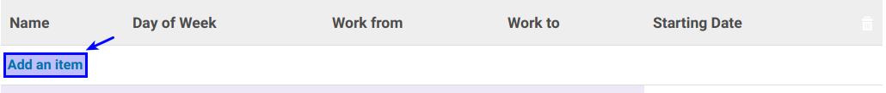

# Membuat Working Time Schedule

*(Instruksi kerja ini merupakan sub instruksi dari (1) [Membuat working Time](./membuat.md), atau (2) [Memodifikasi Working Time](./memodifikasi.md). Instruksi kerja ini tidak bisa berdiri sendiri)*

## A. INPUT

*(Tidak ada prasyarat khusus)*

## B. INSTRUKSI KERJA

1. Buka tab **Working Time Schedule**.
2. <a name="l2">Klik</a> tombol **Add an Item** pada tabel **Working Time Schedule**.

3. Isi **[Name](./penjelasan.md#field-schedule-name)**. Harus diisi.
4. Pilih **[Day Of Week](./penjelasan.md#field-schedule-dayofweek)**. Harus diisi.
5. Isi **[Work From](./penjelasan.md#field-schedule-workfrom)**. Harus diisi.
6. Isi **[Work To](./penjelasan.md#field-schedule-workto)**. Harus diisi.
7. Pilih atau Isi **[Starting Date](./penjelasan.md#field-schedule-startingdate)**. Tidak Harus diisi.
8. Ulangi [langkah ke-2](#l2) untuk menambahkan working Time Schedule.
9. Lanjutkan [langkah ke-7 instruksi Membuat Working Time](./membuat.md#l7) atau [langkah ke-8 instruksi Memodifikasi Working Time](./memodifikasi.md#l8)

## C. OUTPUT

*(Tidak ada instruksi khusus)*
