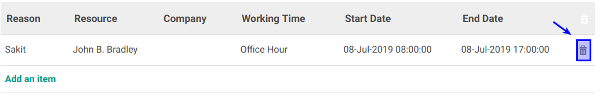

# Menghapus Reason Leave

*(Instruksi kerja ini merupakan sub instruksi dari (1) [Membuat working Time](./membuat.md), atau (2) [Memodifikasi Working Time](./memodifikasi.md). Instruksi kerja ini tidak bisa berdiri sendiri)*

## A. INPUT

*(Tidak ada prasyarat khusus)*

## B. INSTRUKSI KERJA

1. Buka tab **Reason**.
2. <a name="l2">Pilih</a> Data yang akan dihapus
3. Klik tombol **Hapus (Gambar Tong Sampah)** pada tabel **Reason**.

4. Ulangi [langkah ke-2](#l2) untuk menghapus data reason leave.
5. Lanjutkan [langkah ke-14 instruksi Membuat Working Time](./membuat.md#l14) atau [langkah ke-15 instruksi Memodifikasi Working Time](./memodifikasi.md#l15)

## C. OUTPUT

*Data Reason akan terhapus*
